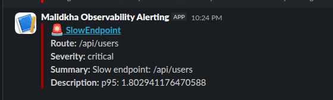
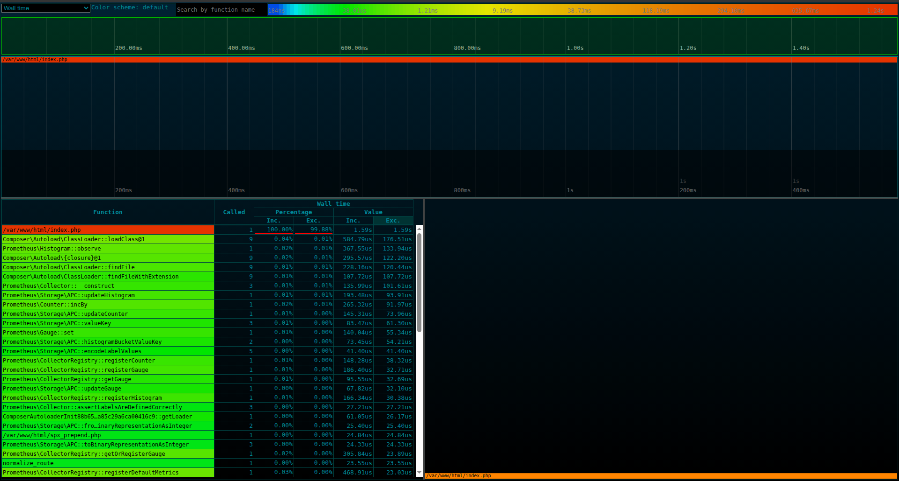

# Performance Observability & Profiling Pipeline

A containerized **performance observability and automated profiling system** for PHP applications.

This project integrates:

- ⚡ Nginx + PHP-FPM application layer
- 📊 Prometheus metrics collection
- 📈 Grafana dashboards
- 🔥 SPX PHP profiler with flamegraphs
- 🚨 Alertmanager for alert routing
- 🧪 k6 load testing for automated performance validation (slow request simulation & profiling) 


This project is intended as a practical demo of how to wire **PHP request metrics**, **alerting**, and **dynamic profiler activation** together into a reproducible Docker-based observability pipeline.

## Table Of Contents

   - **[Overview](#overview)**
   - **[Architecture](#architecture)**
   - **[Repository Layout](#repository-layout)**
   - **[Setup, Requirement & Installation](#setup-requirement-installation)**
      - **[Requirements](#requirements)**
      - **[Setup & Installation ](#setup-installation)**
      - **[Customization](#customization)**
   - **[How it works](#how-it-works)**
        - **[Workflow](#workflow)**
        - **[1. Load Testing (k6)](#1-load-testing-k6)**
        - **[2. Request Flow](#2-request-flow)**
        - **[3. Metrics Collection](#3-metrics-collection)**
        - **[4. Alerting](#4-alerting)**
        - **[5. SPX Profiling](#5-spx-profiling)**
        - **[6. Flamegraphs](#6-flamegraphs)**
      - **[End-to-End Workflow Example](#end-to-end-workflow-example)**
      - **[More Details](#more-details)**
         - **[Prometheus Metrics](#prometheus-metrics)**
         - **[Alerting (Prometheus → Alertmanager)](#alerting-prometheus-alertmanager)**
         - **[SPX Profiling Integration](#spx-profiling-integration)**
         - **[Running Load Tests With K6](#running-load-tests-with-k6)**
   - **[Troubleshooting](#troubleshooting)**

## Overview

This project implements a modern performance engineering pipeline where:

- Instrumented PHP application with Prometheus metrics
- Slow endpoints are automatically detected
- Redis-backed SPX trigger for automatic profiling of slow routes
- Flamegraphs are stored, visualized and browsing via `/flamegraphs`
- Alerts are sent to Slack when performance degrades

The system is fully containerized and reproducible using Docker Compose.


## Architecture

The stack is designed to demonstrate a simple full pipeline:

```bash
[k6 Load Test]
      ↓
   Nginx
      ↓

 PHP-FPM Application
      ↓
Prometheus Metrics Exporter
      ↓
Prometheus Server
      ↓
Alertmanager
      ↓
Slow Requests Detected (P95)
      ↓
SPX Trigger Service
      ↓
SPX PHP Profiler
      ↓
Flamegraph Storage (/spx-data)
      ↓
Flamegraph UI (Web Viewer)
      ↓
Grafana Dashboards + Slack Alerts
```


## Repository Layout

```bash
project-root/
├── docker-compose.yml              # Service definitions
│
├── nginx/
│   └── default.conf                # Nginx config and default site settings
│
├── php/
│   ├── php.dockerfile              # PHP Dockerfile
│   └── spx.ini                     # SPX configs
│
├── prometheus/
│   ├── prometheus.yml              # Prometheus scrape configuration
│   └── alerts.yml                  # Alert rules
│
├── alertmanager/
│   ├── alertmanager.dockerfile     # Alertmanager Dockerfile
│   ├── entrypoint.sh               # Docker entrypoint
│   └── alertmanager.yml            # Alertmanager configuration
│
├── spx-trigger/
│   ├── spx.dockerfile              # PHP-SPX Dockerfile
│   └── index.js                    # Node.js service that receives alerts and enables SPX profiling
│
├── k6/
│   ├── k6.dockerfile               # K6 Dockerfile
│   └── ingest_slow_requests.js     # Load testing script
│   └── entrypoint.sh               # Docker entrypoint
│
├── src/
│   ├── index.php                   # PHP Application entrypoint
│   ├── metrics.php                 # PHP prometheus metrics endpoint
│   └── flamegraphs.php             # Flamegraphs json files web viewer
│   └── spx_prepend.php             # SPX integration
│
└── spx-data/                       # Persistent SPX flamegraph output
│
├── testing/                        # Local testing with k6
│   └── makefile                    # Automated Testing
│   └── scripts/
│   └────  ingest_slow_requests.sh  # Load testing script
```

## Setup, Requirement & Installation

### Requirements

- Docker & Docker Compose
- Optional : 
    - Node.js & K6 (only if need to test locally with `/testing`)

### Setup & Installation 

1. Clone the repository

```bash
git clone https://github.com/khalid-el-masnaoui/Performance-Observability-Profiling-Pipeline
cd Performance-Observability-Profiling-Pipeline
```

2. Copy `.env.example` to `.env` in the repo root folder(configure you SLACK_WEBHOOK URL ...etc)

3. Start the full stack
```bash
docker compose up -d --build

```
4. Services

| Service | URL |
|---|---|
| App | http://localhost:8080 |
| Prometheus  |	http://localhost:9090 |
| Grafana |	http://localhost:3000 |
| Alertmanager  |	 http://localhost:9093
| Flamegraph UI  |	http://localhost:8080/flamegraphs
| SPX Web UI | http://localhost:8080/?SPX_KEY=dev&SPX_UI=1&SPX_UI_URI=/ 

**Note**: The SPX web UI is only available when profiling is triggered!

5. Application Endpoints

- `/` — home route
- `/api/users` — sample API route
- `/metrics` — Prometheus metrics output
- `/flamegraphs` — SPX flamegraph index page
- `/spx-data/<file>.json` — direct SPX flamegraph JSON access
- `/status` — PHP-FPM status endpoint

### Customization

- Add new Prometheus rules in `prometheus/alerts.yml`
- Extend the PHP app in `src/index.php`
- Add new SPX profiling logic in `src/spx_prepend.php`
- Add UI or search to `src/flamegraphs.php`
- Change Nginx routing in `nginx/default.conf`

## How it works

#### Workflow

#### 1. Load Testing (k6)

k6 simulates:

- baseline traffic
- slow endpoint traffic (?delay=)

**Note**: k6 traffic is automatically triggered the first time the application is up (using `k6/entrypoint.sh`). You can also generate traffic locally using `testing/makefile`

#### 2. Request Flow

Each request passes through:

- Nginx routing
- PHP execution
- Metrics collection (Prometheus client)
- Timing instrumentation per route

#### 3. Metrics Collection

Each endpoint exposes:

- Request duration histogram
- Route labels
- Status codes

Example metric:
```bash
app_request_duration_seconds_bucket{route="/api/users"}
```

#### 4. Alerting

Prometheus evaluates:
- p95 latency per route

If triggered:
- Alertmanager sends webhook to trigger SPX profiling
- Alertmanager sends a slack notification


#### 5. SPX Profiling

When a slow endpoint is detected:

- SPX is enabled dynamically
- Only specific requests are profiled (subsequent request of the same route)
- Flamegraphs are generated automatically

<p float="left" align="middle">
   
</p>

#### 6. Flamegraphs

Generated profiles are stored in:
```bash
/spx-data/
```

A web UI allows:
- Listing flamegraphs (as json files)
- you can use tools like `speedscope` or use SPX internal flamegraphs viewer (locally) for :
    - Viewing interactive profiles
    - Debugging slow requests

<p float="left" align="middle">
   
</p>


### End-to-End Workflow Example

1. Load test (k6): **`slow injection`** (`?delay=1.5`)

2. Prometheus detects anomaly: **`p95 increases`**

3. Alertmanager triggers webhook: sends alert event to **`spx-trigger`** service

4. SPX enabled dynamically: only for affected route

5. Flamegraph generated: stored in **`/spx-data`**

6. **`UI visualization`**: inspect flamegraph & identify bottlenecks

```bash
0-30s   → metrics accumulate
30-60s  → p95 increases
~60s    → alert enters "pending"
~120s   → alert fires
         ↓
         slack alert
         ↓
         spx-trigger → Redis
         ↓
next request → SPX profiling ON
         ↓
flamegraph generated
```

### More Details

#### Prometheus Metrics

The PHP app registers metrics using `promphp/prometheus_client_php`.

Example metrics exposed by the app:

- `app_request_duration_seconds_bucket`
- `app_request_duration_seconds_sum`
- `app_request_duration_seconds_count`
- `app_requests_total`

Metrics are labeled by:

- `method`
- `route`
- `status`

Route normalization is applied in `src/index.php` to convert numeric IDs and UUIDs into stable labels.

Query example:
```promql
histogram_quantile(0.95,
  sum(rate(app_request_duration_seconds_bucket[2m])) by (le, route)
)
```

#### Alerting (Prometheus → Alertmanager)

Example alert:

```yaml
- alert: SlowEndpoint
  expr: histogram_quantile(0.95,
    sum(rate(app_request_duration_seconds_bucket[2m])) by (le, route)
  ) > 1
  for: 2m
```

#### SPX Profiling Integration

The PHP image installs SPX in `php/php.dockerfile`.

`src/spx_prepend.php` checks Redis for an active profiling key:

- If Redis contains `spx:<route>`, SPX profiling is started for that request
- Profiling results are stored in `spx-data/`

The `spx-trigger` service receives alerts and writes the route key into Redis with a short TTL.


#### Running Load Tests With K6

The `k6` service can be used to generate synthetic load.

The default script is at `k6/ingest_slow_requests.js` and is launched through `k6/entrypoint.sh`.
## Example Of The Generated Slack Alert & flamegraphs
**Note** : You can also load test the application using `testing/makefile`


## Troubleshooting
1. No flamegraphs generated

Check:
```bash
chmod -R 777 spx-data
chmod 33:33 spx-data # 33 is the UID of www-data which php-fpm/nginx runs under
```

Make sure keys are created in redis
```bash
docker exec -it prometheus-spx-redis-1 redis-cli KEYS "*"
```

2. SPX not triggering

Ensure:
```ini
spx.http_enabled=1
spx.http_key=dev
```

3. 404 on flamegraphs

Check Nginx:

```nginx
location ^~ /spx-data/ {
    alias /tmp/spx/;
    autoindex on;
}
```

Check flamegraphs data is stored in `spx-data/`
```bash
sudo chown 33:33 spx-data/ #33 is the UID for www-data which nginx/php-fpm runs under
sudo chmod -R 777 spx-data/
```
